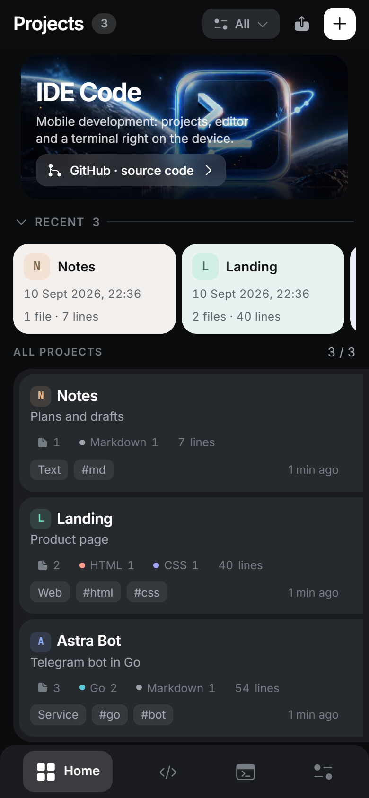
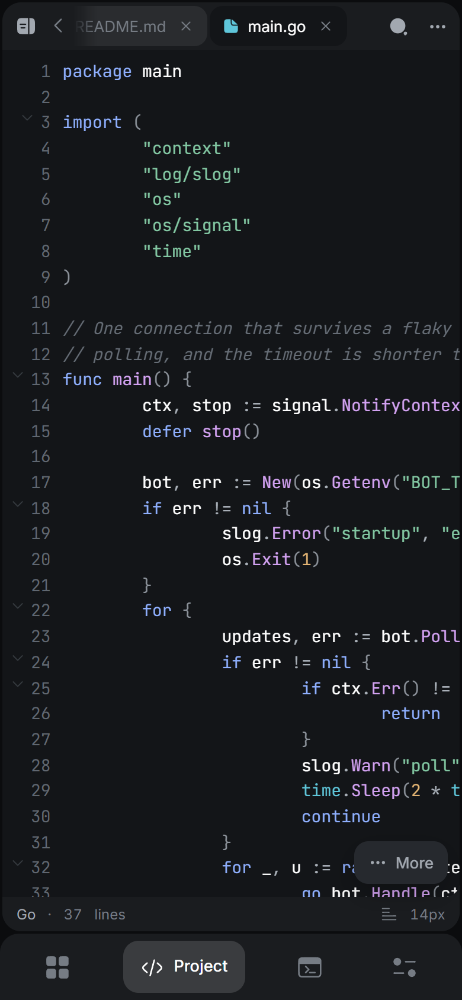
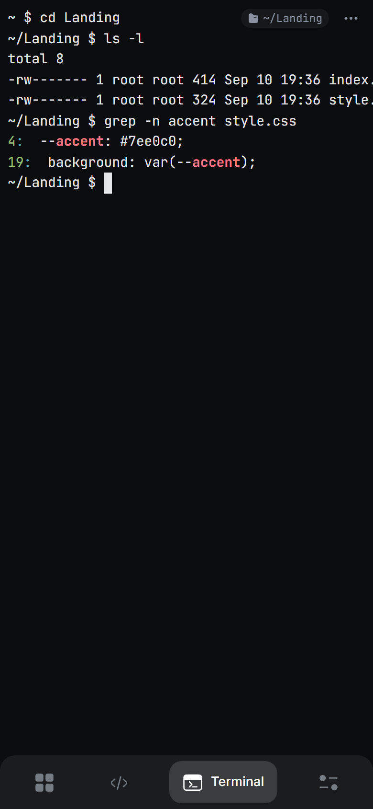
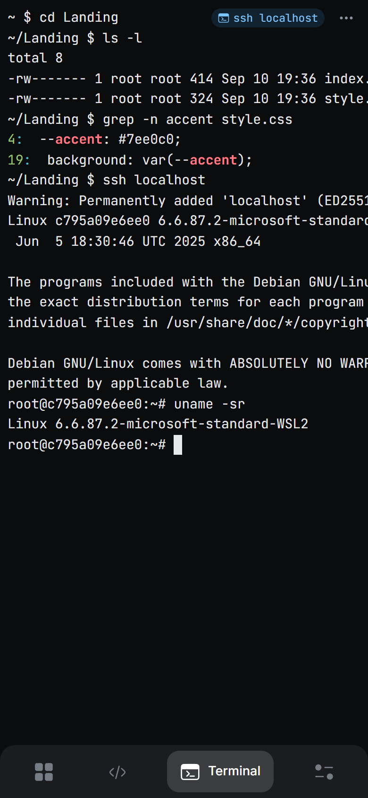
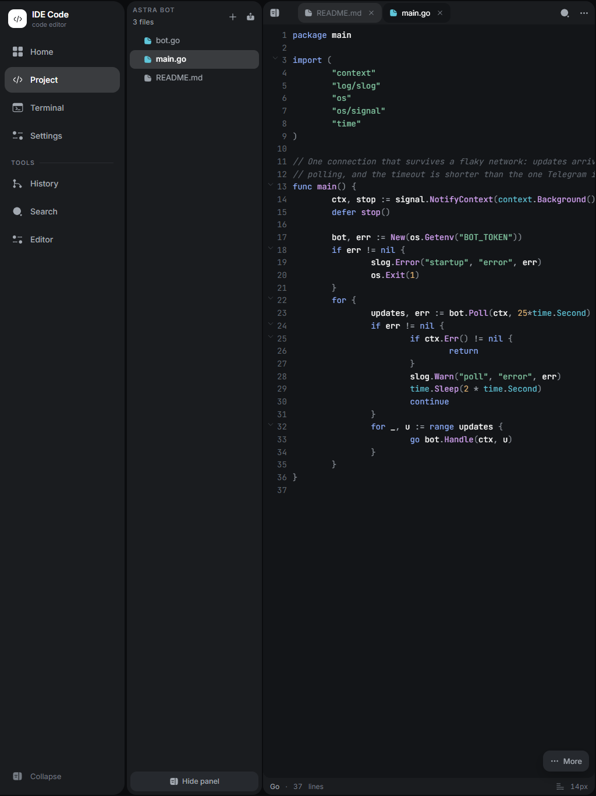
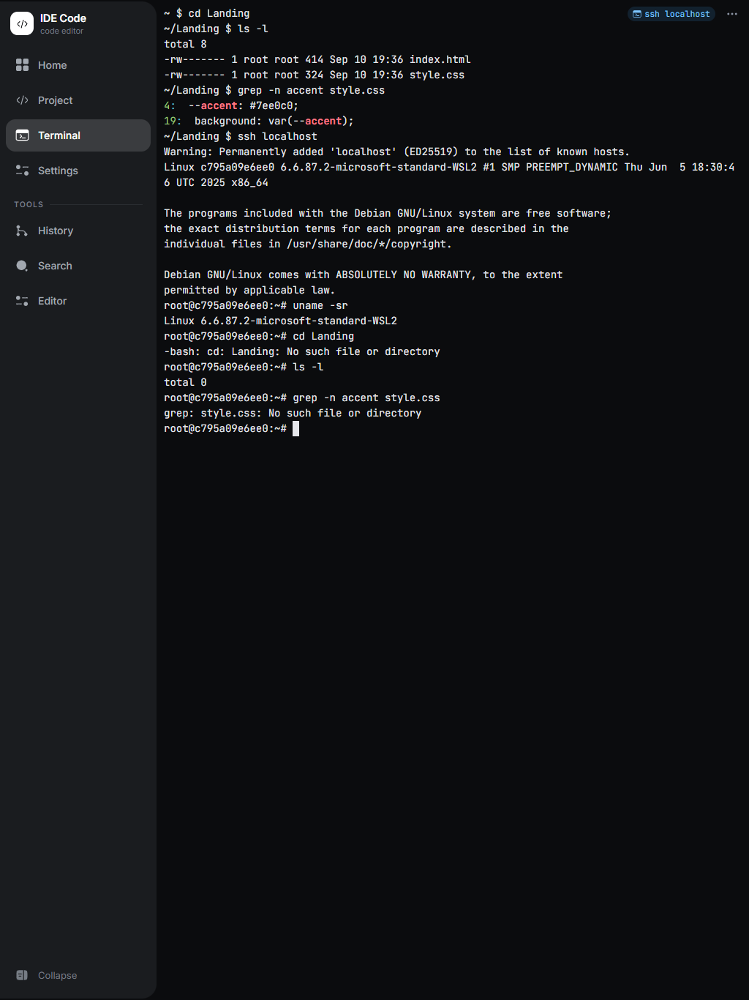
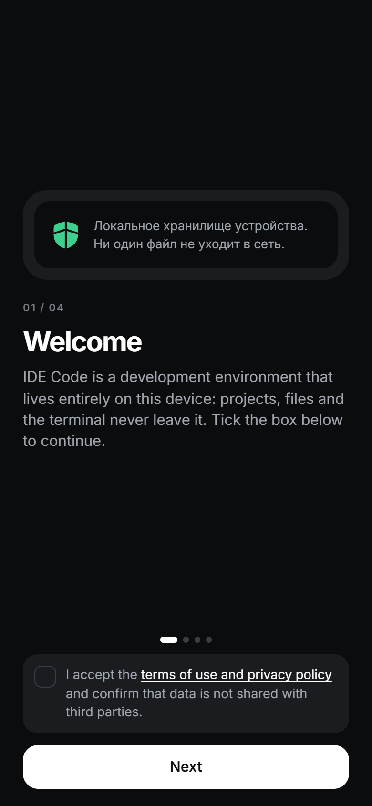
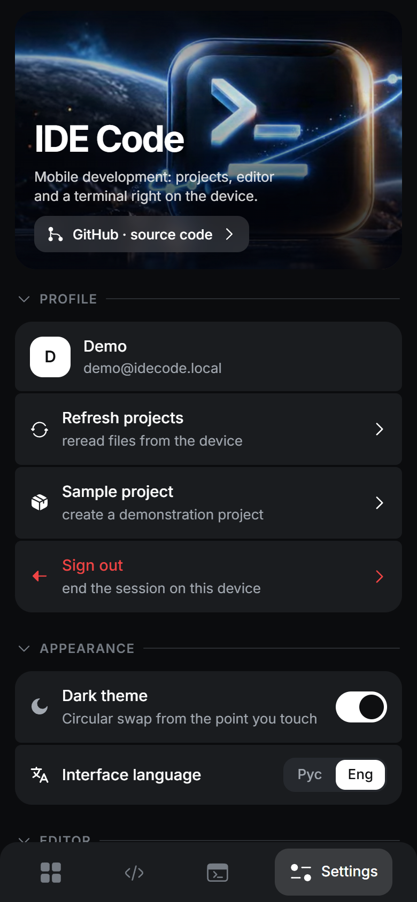
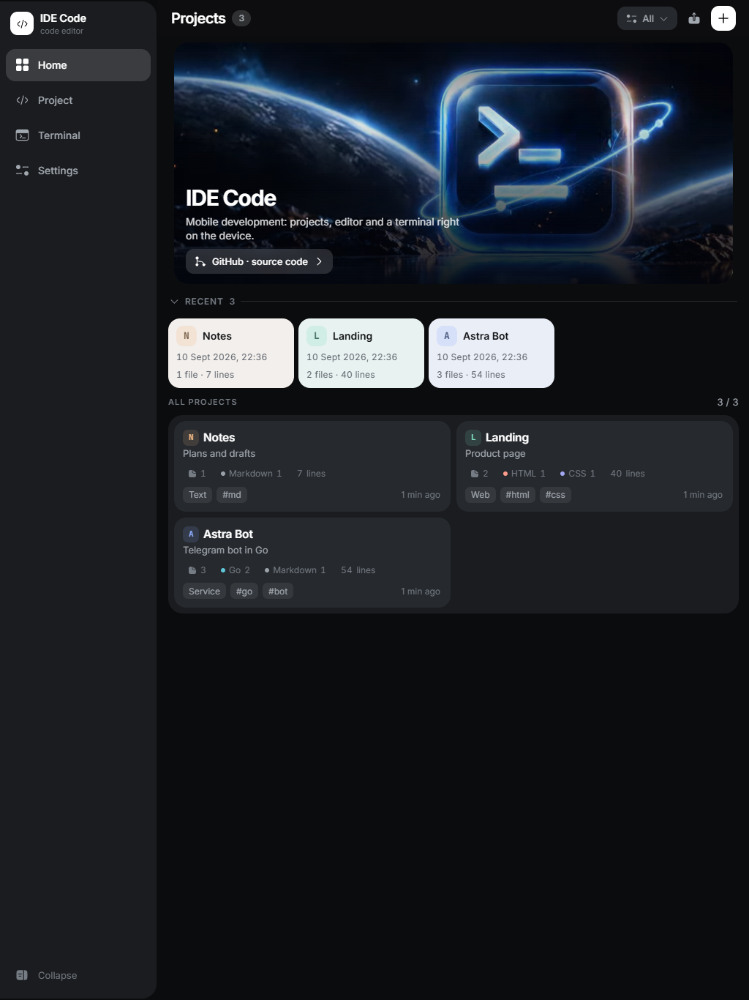

<h1 align="center">IDE Code</h1>

<p align="center">
  A development environment that fits in a phone: your projects, a real editor and a <b>real terminal</b> — running on the device itself.
</p>

<p align="center">
  <a href="https://github.com/SergeyLubivui-dev/ide-code-mobile/actions/workflows/ci.yml"></a>
  <a href="https://github.com/SergeyLubivui-dev/ide-code-mobile/releases/latest"></a>
  <a href="https://github.com/SergeyLubivui-dev/ide-code-mobile/releases"></a>
  <a href="https://github.com/SergeyLubivui-dev/ide-code-mobile/stargazers"></a>
  <a href="https://github.com/SergeyLubivui-dev/ide-code-mobile/watchers"></a>
  <a href="LICENSE"></a>
</p>

<p align="center">
  
  
  
  
</p>

<p align="center">
  <b>English</b> · <a href="README.ru.md">Русский</a>
</p>

<p align="center">
  
  
  
</p>

## Download

**[⬇ Get the latest APK](https://github.com/SergeyLubivui-dev/ide-code-mobile/releases/latest)** — one signed file, no store, no account.

Android 8.0 (API 26) and newer, `arm64-v8a` and `armeabi-v7a`. The engine ships inside the APK, so there is nothing else to install. Android will ask you to allow installing from an unknown source — that is the price of a store-free build.

## The idea

Writing code on a phone usually means one of two things: a text editor with no shell, or a shell with no editor. IDE Code is an attempt to have both in one place, and to make the terminal the part that actually feels good to use — so you can look around a project, build it and fix it from the device you already have in your hand.

Everything runs **on the device**. Projects, files, restore points and the shell live in the app's private storage; there is no account and nothing is uploaded anywhere. A separate server mode exists for when you want the phone to be a thin client to a real machine.

This is an early version. The editor and the terminal work; running and testing your code from inside the app is the next step, not a promise already kept.

## What works today

**Terminal.** A real PTY on the device shell, not a simulation: pipes, job control, `git`, `ssh`, `less` — whatever the device actually has. Sessions survive the app going to the background, and the on-screen keyboard does not push the cursor out of view.

The prompt is short on purpose. An Android app's data directory is `/data/user/0/<package>/files`, and printing it in full ate half the line before you could type anything. The prompt counts from the projects folder instead:

```
~ $ cd Landing
~/Landing $ ls -l
```

Go outside the projects folder and it shows an honest absolute path. A badge in the corner says where the shell is standing — and when you `ssh` somewhere, it says which machine you are on, because from that moment the prompt is drawn by someone else's shell.

**Editor.** Syntax highlighting for 24 file types, line numbers, folding by indentation, in-file search, a row of special characters under the keyboard, and a save button that only appears when there is something to save. Markdown has a Code / Preview switch.

**Projects.** File tree, import from device storage, tags and themes, restore points with a real diff of what changed, search inside a file, inside a project, or across all projects.

**Interface.** Dark and light themes, Russian and English, and a layout that becomes a proper two-pane IDE on a tablet.

## Screenshots

### Phone

| Projects | Editor | Terminal | SSH |
| --- | --- | --- | --- |
|  |  |  |  |

### Tablet

| Editor | Terminal |
| --- | --- |
|  |  |

<details>
<summary>More screens</summary>

| Onboarding | Settings | Tablet projects |
| --- | --- | --- |
|  |  |  |

</details>

## Server mode

The same interface can talk to a server instead of the device. Then the shell is **PowerShell 7** in a throwaway container per session, files live on the server, and several people can share a project with roles.

```bash
docker compose up -d --build
```

Open `http://localhost:5738`, sign in with an email and a name (there is no password — the first sign-in creates the account) and create a project. To use it from a phone, open the same address on the computer's LAN IP.

Each terminal session is a separate container: uid 1000, read-only root filesystem, `cap-drop=ALL`, `no-new-privileges`, 512 MiB, 1 CPU, its own bridge network with no route to the database or the API. The only writable mount is that one project's folder.

`start.cmd` and `stop.cmd` wrap the same thing on Windows. `powershell -NoProfile -File .\test.ps1` runs the whole pipeline: `go vet`, `go test -race` (including two real PTYs), a migration round-trip, DOM tests at phone and tablet widths, and a restart-survival check.

## Build from source

You need Docker, Python 3 and — for the APK — JDK 17 and the Android SDK.

```bash
python build.py            # src/*  →  dist/index.html and dist/ide-code.html
python tools/build-local.py  # the same UI with JSX pre-compiled, for the device engine
python tools/build-apk.py    # everything above + cross-compiled engine + Gradle
```

Signing keys are read from `android/keystore.properties`, which is not in this repository. Without it Gradle builds an unsigned APK.

## How it is put together

| Piece | What it is |
| --- | --- |
| `src/` | The whole interface: one React app split into an HTML shell and four JSX modules, no bundler |
| `backend/internal/local/` | The device engine: HTTP, JSON state, files and a real PTY. Compiles to a static binary and ships inside the APK as `libidecode.so` |
| `backend/internal/engine/` | The server engine: PostgreSQL, roles, audit, per-session Docker sandboxes |
| `backend/sandbox/` | The PowerShell sandbox image and its prompt/colour profile |
| `android/` | A thin Kotlin shell: a WebView, a foreground service and the engine binary |
| `tools/` | Build scripts for the web bundle, the APK and the banner |

There is no bundler and no build step for the UI in server mode: `build.py` concatenates the files in a fixed order, and Babel compiles the JSX in the browser. For the device build the JSX is compiled ahead of time — on a phone Babel parsing a megabyte and a half at every start was the most noticeable delay.

## Roadmap

- [x] A terminal that is comfortable on a phone: short prompt, colour, session that survives backgrounding
- [x] Editor with highlighting, folding and restore points
- [ ] Run a project from the editor and see its output
- [ ] Run tests on the device and show what failed
- [ ] Package managers and toolchains inside the device engine

## Limits worth knowing

- The device terminal has **no isolation**. It runs with the app's own permissions and sees exactly what the app sees. The server mode's sandbox is the one with real boundaries.
- There is no PowerShell on Android — .NET has no Android build. The device shell is whatever the device ships, usually `mksh`.
- `ssh` is present in the server sandbox; on Android it exists only if the device or another app provides it.
- Import from device storage reads text files up to 512 KiB.

## License

[Apache License 2.0](LICENSE).
