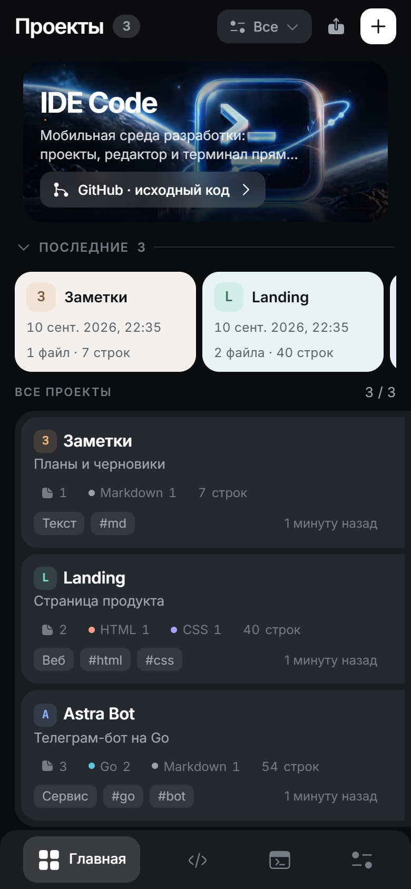
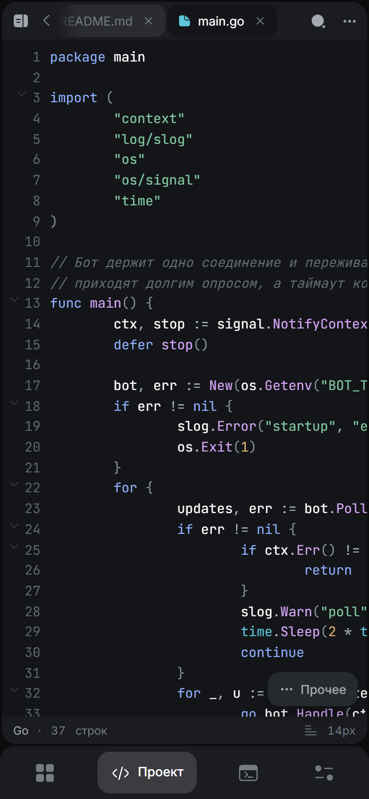
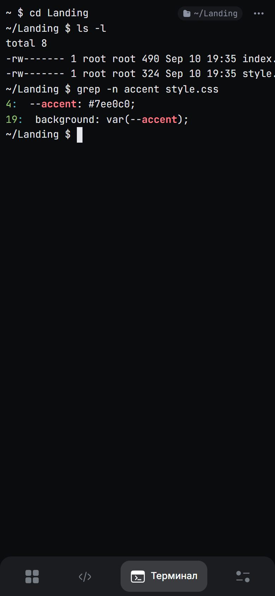
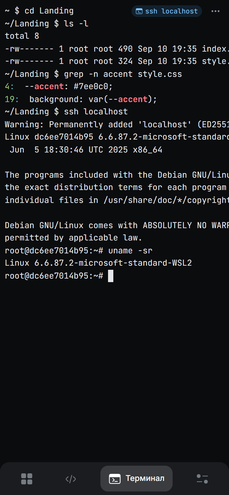
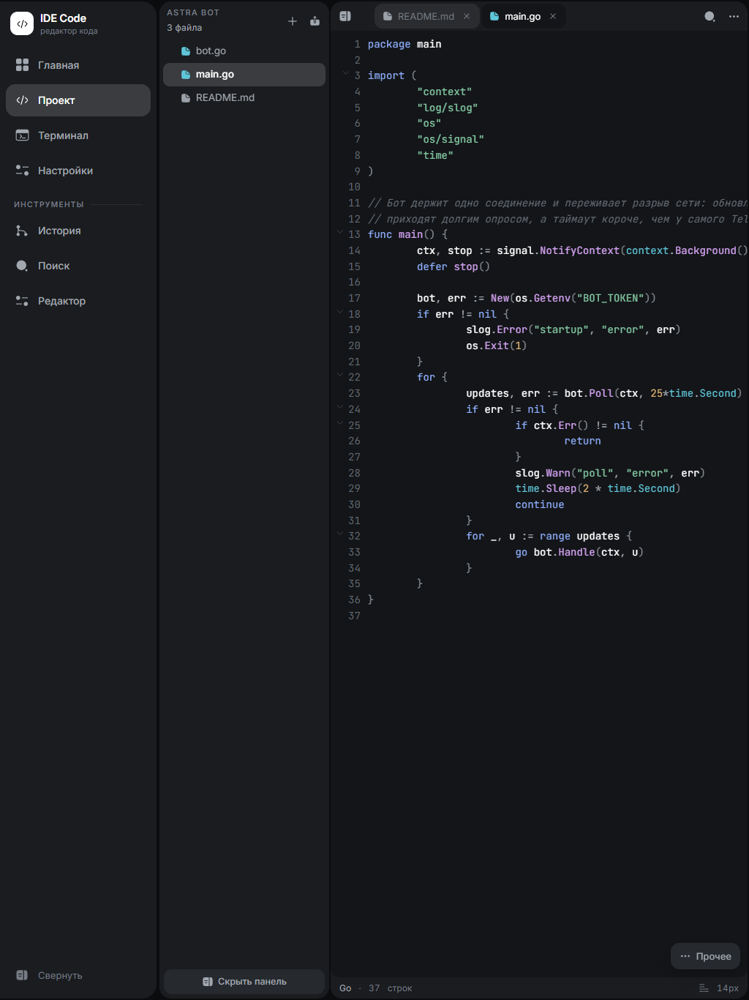
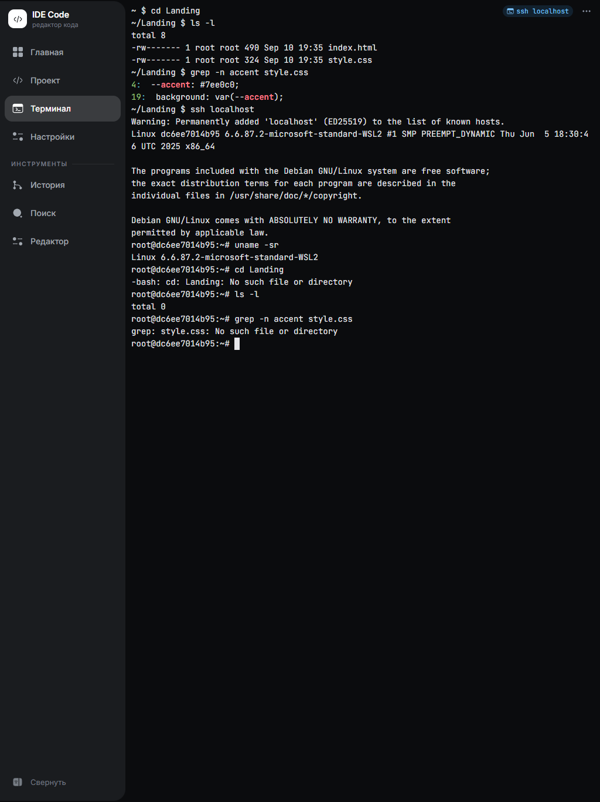
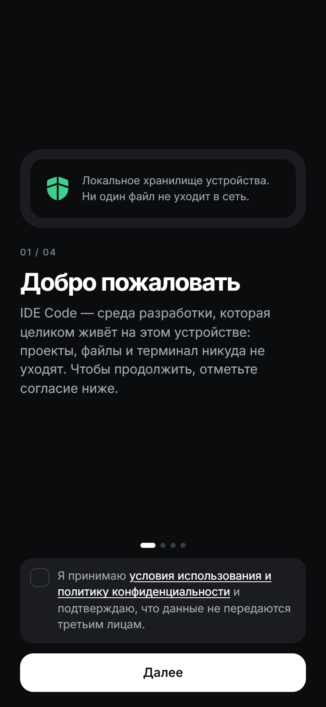
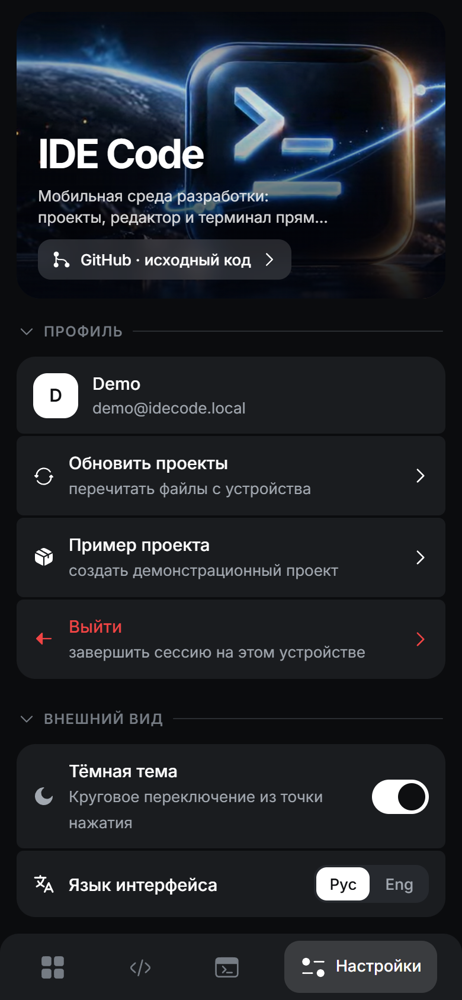
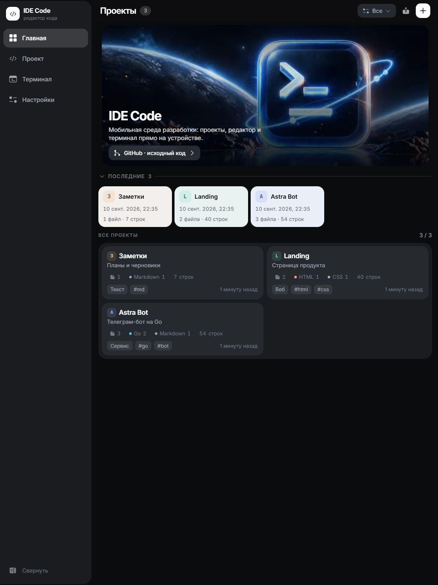

<h1 align="center">IDE Code</h1>

<p align="center">
  Среда разработки, которая помещается в телефон: проекты, настоящий редактор и <b>настоящий терминал</b> — прямо на устройстве.
</p>

<p align="center">
  <a href="https://github.com/SergeyLubivui-dev/ide-code-mobile/releases/latest"></a>
  <a href="https://github.com/SergeyLubivui-dev/ide-code-mobile/releases"></a>
  <a href="https://github.com/SergeyLubivui-dev/ide-code-mobile/stargazers"></a>
  <a href="https://github.com/SergeyLubivui-dev/ide-code-mobile/watchers"></a>
  <a href="LICENSE"></a>
</p>

<p align="center">
  
  
  
  
</p>

<p align="center">
  <a href="README.md">English</a> · <b>Русский</b>
</p>

<p align="center">
  
  
  
</p>

## Скачать

**[⬇ Последний APK](https://github.com/SergeyLubivui-dev/ide-code-mobile/releases/latest)** — один подписанный файл, без магазина и без аккаунта.

Android 8.0 (API 26) и новее, `arm64-v8a` и `armeabi-v7a`. Движок лежит внутри APK, доустанавливать нечего. Android спросит разрешение на установку из неизвестного источника — это плата за сборку мимо магазина.

## Идея

Писать код с телефона обычно означает одно из двух: текстовый редактор без оболочки или оболочка без редактора. IDE Code — попытка держать и то и другое в одном месте и сделать удобным именно терминал, чтобы с устройства, которое и так в руке, можно было посмотреть проект, собрать его и починить.

Всё работает **на устройстве**. Проекты, файлы, точки восстановления и оболочка лежат в приватном каталоге приложения; аккаунта нет, наружу ничего не уходит. Отдельно есть серверный режим — на случай, когда телефон должен быть тонким клиентом к настоящей машине.

Это ранняя версия. Редактор и терминал работают; запуск и прогон тестов прямо из приложения — следующий шаг, а не уже выполненное обещание.

## Что работает сейчас

**Терминал.** Настоящий PTY на оболочке устройства, а не имитация: конвейеры, управление задачами, `git`, `ssh`, `less` — всё, что на устройстве действительно есть. Сессия переживает сворачивание приложения, а экранная клавиатура не выталкивает курсор из кадра.

Приглашение специально короткое. Каталог данных приложения на Android — это `/data/user/0/<пакет>/files`, и полный путь занимал полстроки ещё до того, как получалось что-то набрать. Приглашение считается от папки проектов:

```
~ $ cd Landing
~/Landing $ ls -l
```

Ушли за пределы папки проектов — виден честный абсолютный путь. Плашка в углу показывает, где стоит оболочка, а после `ssh` — на какой машине вы работаете: с этого момента приглашение рисует уже чужая оболочка.

**Редактор.** Подсветка 24 типов файлов, номера строк, сворачивание блоков по отступу, поиск по файлу, ряд спецсимволов под клавиатурой и кнопка сохранения, которая всплывает только когда есть что сохранять. Для Markdown — переключатель «Код / Просмотр».

**Проекты.** Дерево файлов, импорт из памяти устройства, теги и темы, точки восстановления с разбором того, что изменилось, поиск по файлу, по проекту и по всем проектам сразу.

**Интерфейс.** Тёмная и светлая темы, русский и английский, а на планшете раскладка становится нормальной двухпанельной IDE.

## Скриншоты

### Телефон

| Проекты | Редактор | Терминал | SSH |
| --- | --- | --- | --- |
|  |  |  |  |

### Планшет

| Редактор | Терминал |
| --- | --- |
|  |  |

<details>
<summary>Остальные экраны</summary>

| Онбординг | Настройки | Проекты на планшете |
| --- | --- | --- |
|  |  |  |

</details>

## Серверный режим

Тот же интерфейс умеет работать не с устройством, а с сервером. Тогда оболочка — **PowerShell 7** в одноразовом контейнере на сессию, файлы лежат на сервере, а над проектом может работать несколько человек с разными ролями.

```bash
docker compose up -d --build
```

Открыть `http://localhost:5738`, войти по почте и имени — пароля нет, первый вход создаёт аккаунт — и создать проект. Чтобы зайти с телефона, откройте тот же адрес по LAN-IP компьютера.

Каждая сессия терминала — отдельный контейнер: uid 1000, read-only корневая файловая система, `cap-drop=ALL`, `no-new-privileges`, 512 МиБ, 1 CPU, своя bridge-сеть без доступа к базе и API. Единственный монтируемый на запись каталог — папка одного проекта.

`start.cmd` и `stop.cmd` — то же самое в одну команду на Windows. `powershell -NoProfile -File .\test.ps1` прогоняет весь конвейер: `go vet`, `go test -race` (включая два настоящих PTY), roundtrip миграций, DOM-тесты на ширине телефона и планшета и проверку переживания рестарта.

## Сборка из исходников

Нужны Docker, Python 3, а для APK — ещё JDK 17 и Android SDK.

```bash
python build.py              # src/*  →  dist/index.html и dist/ide-code.html
python tools/build-local.py  # тот же интерфейс с заранее собранным JSX, для движка устройства
python tools/build-apk.py    # всё вышеперечисленное + кросс-сборка движка + Gradle
```

Ключи подписи берутся из `android/keystore.properties`, которого в репозитории нет. Без него Gradle соберёт неподписанный APK.

## Как всё устроено

| Часть | Что это |
| --- | --- |
| `src/` | Весь интерфейс: одно React-приложение, разложенное на HTML-оболочку и четыре JSX-модуля, без сборщика |
| `backend/internal/local/` | Движок устройства: HTTP, состояние в JSON, файлы и настоящий PTY. Компилируется в статический бинарник и едет в APK как `libidecode.so` |
| `backend/internal/engine/` | Серверный движок: PostgreSQL, роли, аудит, песочницы Docker на сессию |
| `backend/sandbox/` | Образ песочницы PowerShell и её профиль с приглашением и цветами |
| `android/` | Тонкая обёртка на Kotlin: WebView, фоновая служба и бинарник движка |
| `tools/` | Скрипты сборки веб-части, APK и баннера |

Сборщика нет и шага сборки интерфейса в серверном режиме тоже: `build.py` склеивает файлы в фиксированном порядке, а JSX разбирает Babel прямо в браузере. Для сборки под устройство JSX компилируется заранее — на телефоне разбор полутора мегабайт при каждом запуске был самой заметной задержкой.

## План

- [x] Терминал, которым удобно пользоваться с телефона: короткое приглашение, цвет, сессия переживает сворачивание
- [x] Редактор с подсветкой, сворачиванием блоков и точками восстановления
- [ ] Запуск проекта из редактора с показом вывода
- [ ] Прогон тестов на устройстве с разбором того, что упало
- [ ] Пакетные менеджеры и тулчейны внутри движка устройства

## О чём стоит знать

- У терминала на устройстве **нет изоляции**. Он работает с правами самого приложения и видит ровно то, что видит оно. Настоящие границы — у песочницы серверного режима.
- PowerShell на Android нет: сборок .NET под Android не существует. Оболочка устройства — та, что на нём есть, обычно `mksh`.
- `ssh` есть в песочнице сервера; на Android он доступен, только если его даёт само устройство или другое приложение.
- Импорт из памяти устройства читает текстовые файлы до 512 КиБ.

## Лицензия

[Apache License 2.0](LICENSE).
